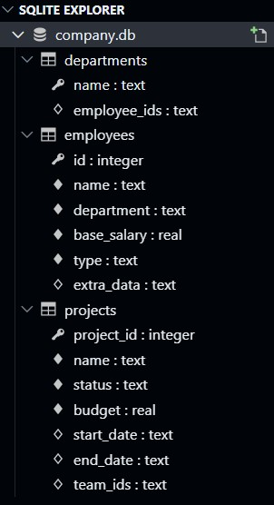
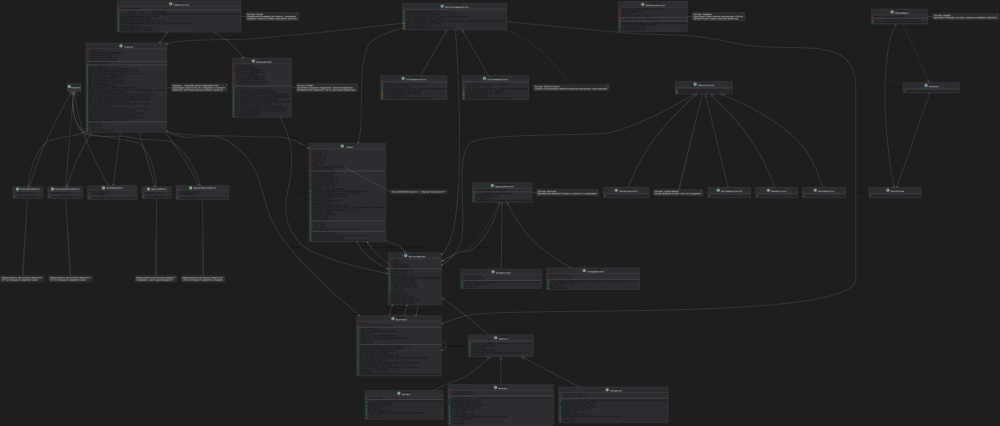

# **Отчёт по лабораторной работе**  
**Тема:** Применение паттернов проектирования в системе учета сотрудников

## Сведения о студенте
**Дата:** 2025-11-24
**Семестр:** 2 курс 1 семестр
**Группа:** ПИН-б-о-24-1
**Дисциплина:** Технологии программирования
**Студент:** Губжоков Роман Русланович

---

## Оглавление

1. [Введение](#введение)
2. [Часть 1: Порождающие паттерны](#часть-1-порождающие-паттерны)
3. [Часть 2: Структурные паттерны](#часть-2-структурные-паттерны)
4. [Часть 3: Поведенческие паттерны](#часть-3-поведенческие-паттерны)
5. [Часть 4: Комбинированные паттерны](#часть-4-комбинированные-паттерны)
6. [Сравнение до и после рефакторинга](#сравнение-до-и-после-рефакторинга)
7. [Заключение](#заключение)

---

## Введение

### Цель работы
Освоить практическое применение паттернов проектирования для рефакторинга и улучшения кодовой базы системы учета сотрудников. Получить навыки применения различных паттернов для решения типичных задач проектирования ПО.

### Используемые технологии
- **Язык программирования:** Python 3.8+
- **База данных:** SQLite (опционально)
- **Дополнительные библиотеки:** `abc`, `json`, `sqlite3`
- **Инструменты:** Visual Studio Code, Git

### Теоретическая часть
Паттерны проектирования — это типичные способы решения часто встречающихся проблем в проектировании ПО. В данной работе рассматриваются:

1. **Порождающие паттерны:** Singleton, Factory Method, Abstract Factory, Builder
2. **Структурные паттерны:** Adapter, Decorator, Facade
3. **Поведенческие паттерны:** Observer, Strategy, Command
4. **Комбинированные паттерны:** Repository, Unit of Work, Specification

Из них были реализованы:
1. [Singleton](#11-singleton-одиночка)
2. [Factory Method](#12-factory-method-фабричный-метод)
3. [Abstract Factory](#13-abstract-factory-абстрактная-фабрика)
4. [Builder](#14-builder-строитель)
5. [Adapter](#21-adapter-адаптер)
6. [Decorator](#22-decorator-декоратор)
7. [Facade](#23-facade-фасад)

---

## Часть 1: Порождающие паттерны

### 1.1. Singleton (Одиночка)

**Задача:** Создать класс `DatabaseConnection` для управления подключением к БД SQLite.

**Требования:** Гарантировать единственное подключение к БД в рамках приложения.

**DatabaseConnection**

```python
import sqlite3
import os
from typing import Optional
import threading


class DatabaseConnection:
    _instance: Optional['DatabaseConnection'] = None
    _lock = threading.Lock()

    def __init__(self, db_path: str = "company.db"):
        os.makedirs(os.path.dirname(db_path) or '.', exist_ok=True)
        self._db_path = os.path.abspath(db_path)
        self._connection = sqlite3.connect(self._db_path, check_same_thread=False)
        self._connection.row_factory = sqlite3.Row

    @classmethod
    def get_instance(cls, db_path: str = "company.db") -> 'DatabaseConnection':
        if cls._instance is None:
            with cls._lock:
                if cls._instance is None:
                    cls._instance = cls(db_path)
        return cls._instance

    def get_connection(self) -> sqlite3.Connection:
        return self._connection

    def close_connection(self) -> None:
        if self._connection:
            self._connection.close()
            DatabaseConnection._instance = None
            self._connection = None

    @property
    def db_path(self) -> str:
        return self._db_path
```

#### Для работы с новым классом и sqlite3 стало необходимым сделать изменения в классе Company:

``` python
    ...
    def save_to_db(self, db_path: str = 'company.db') -> None:
        db_conn = DatabaseConnection.get_instance(db_path).get_connection()
        cursor = db_conn.cursor()
        
        try:
            cursor.execute('''
                CREATE TABLE IF NOT EXISTS employees (
                    id INTEGER PRIMARY KEY,
                    name TEXT NOT NULL,
                    department TEXT NOT NULL,
                    base_salary REAL NOT NULL,
                    type TEXT NOT NULL, -- 'Employee', 'Manager', 'Developer', 'Salesperson'
                    extra_data TEXT -- JSON для бонусов, tech_stack и т.д.
                )
            ''')
            
            cursor.execute('''
                CREATE TABLE IF NOT EXISTS departments (
                    name TEXT PRIMARY KEY,
                    employee_ids TEXT
                )
            ''')
            
            cursor.execute('''
                CREATE TABLE IF NOT EXISTS projects (
                    project_id INTEGER PRIMARY KEY,
                    name TEXT NOT NULL,
                    status TEXT NOT NULL,
                    budget REAL NOT NULL,
                    start_date TEXT,
                    end_date TEXT,
                    team_ids TEXT
                )
            ''')
            
            cursor.execute("DELETE FROM employees")
            cursor.execute("DELETE FROM departments")
            cursor.execute("DELETE FROM projects")
            
            for dept in self.__departments:
                emp_ids = [str(emp.id) for emp in dept.emp_list]
                cursor.execute(
                    "INSERT INTO departments (name, employee_ids) VALUES (?, ?)",
                    (dept.name, json.dumps(emp_ids))
                )
                
            all_employees = self.get_all_employees()
            for emp in all_employees:
                extra = json.dumps(emp.to_dict())
                cursor.execute(
                    "INSERT INTO employees (id, name, department, base_salary, type, extra_data) VALUES (?, ?, ?, ?, ?, ?)",
                    (emp.id, emp.name, emp.department, emp.base_salary, type(emp).__name__, extra)
                )
            
            for proj in self.__projects:
                team_ids = [str(emp.id) for emp in proj.get_team()]
                cursor.execute(
                    "INSERT INTO projects (project_id, name, status, budget, start_date, end_date, team_ids) VALUES (?, ?, ?, ?, ?, ?, ?)",
                    (proj.project_id, proj.name, proj.status, proj.budget,
                     proj.start_date.isoformat() if proj.start_date else None,
                     proj.end_date.isoformat() if proj.end_date else None,
                     json.dumps(team_ids))
                )
            
            db_conn.commit()
            print(f"Компания '{self.name}' сохранена в БД: {db_path}")
            print(f"Сотрудников: {len(all_employees)}, Отделов: {len(self.__departments)}, Проектов: {len(self.__projects)}")
        
        except sqlite3.Error as e:
            db_conn.rollback()
            raise ValueError(f"Ошибка БД: {e}")
        finally:
            cursor.close()
    
    def load_from_db(self, db_path: str = "company.db") -> None:
        db_conn = DatabaseConnection.get_instance(db_path).get_connection()
        cursor = db_conn.cursor()

        try:
            self.__departments.clear()
            self.__projects.clear()
            self.__employee_ids.clear()
            self.__project_ids.clear()

            cursor.execute("SELECT * FROM employees")
            employees_by_id = {}

            for row in cursor.fetchall():
                emp_data = json.loads(row['extra_data'])
                emp_type = row['type']

                if emp_type == "Manager":
                    emp = Manager.from_dict(emp_data)
                elif emp_type == "Developer":
                    emp = Developer.from_dict(emp_data)
                elif emp_type == "Salesperson":
                    emp = Salesperson.from_dict(emp_data)
                elif emp_type == "Employee":
                    emp = Employee.from_dict(emp_data)
                else:
                    raise ValueError(f"Неизвестный тип: {emp_type}")

                employees_by_id[emp.id] = emp
                self.__employee_ids[emp.id] = emp.department

            cursor.execute("SELECT * FROM departments")
            for row in cursor.fetchall():
                dept_name = row['name']
                emp_ids_json = row['employee_ids']
                emp_ids = json.loads(emp_ids_json) if emp_ids_json else []

                dept = Department(dept_name)
                for emp_id_str in emp_ids:
                    emp_id = int(emp_id_str)
                    if emp_id in employees_by_id:
                        dept.add_employee(employees_by_id[emp_id])
                    else:
                        print(f"Предупреждение: сотрудник ID {emp_id} не найден при загрузке отдела {dept_name}")

                self.__departments.append(dept)

            cursor.execute("SELECT * FROM projects")
            for row in cursor.fetchall():
                start_date = datetime.fromisoformat(row['start_date']).date() if row['start_date'] else None
                end_date = datetime.fromisoformat(row['end_date']).date() if row['end_date'] else None

                proj_data = {
                    'project_id': row['project_id'],
                    'name': row['name'],
                    'description': '',
                    'start_date': start_date,
                    'end_date': end_date,
                    'budget': row['budget'],
                    'status': row['status'],
                    'team': []
                }
                proj = Project.from_dict(proj_data)
                self.__projects.append(proj)
                self.__project_ids[proj.project_id] = True


                team_ids_json = row['team_ids']
                team_ids = json.loads(team_ids_json) if team_ids_json else []
                for emp_id_str in team_ids:
                    emp_id = int(emp_id_str)
                    if emp_id in employees_by_id:
                        proj.add_team_member(employees_by_id[emp_id])

            print(f"Компания '{self.name}' успешно загружена из БД: {db_path}")
            print(f"→ Сотрудников: {len(employees_by_id)}, Отделов: {len(self.__departments)}, Проектов: {len(self.__projects)}")

        except sqlite3.Error as e:
            db_conn.rollback()
            raise ValueError(f"Ошибка загрузки из БД: {e}")
        finally:
            cursor.close()
    ...
```

**Тестирование:**

```python
import sys
import os

sys.path.insert(0, "C:/Users/DezerTear/Desktop/uni/progtech/OOP_practice_files")

from source.lab0204_company import Company
from source.lab03_singleton import DatabaseConnection
from source.lab0203_department import Department
from source.lab0202_manager import Manager
from source.lab0202_developer import Developer
from source.lab0202_salesperson import Salesperson
from source.lab0202_employee import Employee

db_path = os.path.abspath("OOP_practice_files/sqlite3_DB/company.db")

db_connection = DatabaseConnection.get_instance(db_path) 

company = Company("TestCorp")

employees = [
        Manager(1, "Alice Johnson", "Development", 7000, 2000),
        Developer(2, "Bob Smith", "Development", 5000, 
                 ["Python", "SQL", "Django", "FastAPI"], "senior"),
        Developer(3, "Carol Davis", "Development", 4500,
                 ["JavaScript", "React", "Node.js"], "middle"),
        Salesperson(4, "David Wilson", "Sales", 4000, 0.12, 75000),
        Salesperson(5, "Eva Martinez", "Sales", 3800, 0.10, 60000),
        Employee(6, "Frank Brown", "Marketing", 3500)
    ]
dept_mapping = {
    "Development": [employees[0], employees[1], employees[2]],
    "Sales": [employees[3], employees[4]],
    "Marketing": [employees[5]]
}

for name in dept_mapping:
    print(name)
    dept = Department(name)
    company.add_department(dept)
    
for dept_name, dept_employees in dept_mapping.items():
    dept = company.get_department(dept_name)
    for emp in dept_employees:
        dept.add_employee(emp)

company.save_to_db(db_path)
company.clear_departments()
company.load_from_db(db_path)
print(company)
```

**Результаты тестирования**:
```powershell
Development
Отдел 'Development' добавлен в компанию 'TestCorp'
Sales
Отдел 'Sales' добавлен в компанию 'TestCorp'      
Marketing
Отдел 'Marketing' добавлен в компанию 'TestCorp'  
Компания 'TestCorp' сохранена в БД: C:\Users\DezerTear\Desktop\uni\progtech\OOP_practice_files\sqlite3_DB\company.db
Сотрудников: 6, Отделов: 3, Проектов: 0
Компания 'TestCorp' успешно загружена из БД: C:\Users\DezerTear\Desktop\uni\progtech\OOP_practice_files\sqlite3_DB\company.db
→ Сотрудников: 6, Отделов: 3, Проектов: 0
Company 'TestCorp' (Отделов: 3, Проектов: 0, Сотрудников: 6, Месячные расходы: 52050.00 руб.)
```
#### В результате теста была создана БД `company.db`:



#### Было произведено успешное создание БД, импорт из .db и экспорт в .db посредством функций класса `Company` и единого подключения через класс `DatabaseConnection`.

**Преимущества:**
- Гарантирует единственный экземпляр подключения
- Экономит ресурсы
- Упрощает управление состоянием

**Недостатки:**
- Усложняет тестирование
- Может скрывать зависимости
- Потенциальные проблемы с многопоточностью

---

### 1.2. Factory Method (Фабричный метод)

**Задача:** Рефакторинг существующей `EmployeeFactory` из ЛР №2.

**Требования:** Создать абстрактный класс `EmployeeFactory` с методом `create_employee()`. Реализовать конкретные фабрики для каждого типа сотрудников.

**Реализация:**

**Employee Factory**

```python
from abc import ABC, abstractmethod
from typing import Dict, Any
import sys

sys.path.insert(0, "C:/Users/DezerTear/Desktop/uni/progtech/OOP_practice_files")

from source.lab0202_employee import Employee
from source.lab0202_manager import Manager
from source.lab0202_developer import Developer
from source.lab0202_salesperson import Salesperson

class EmployeeFactory(ABC):
    @abstractmethod
    def create_employee(self, **kwargs) -> Employee:
        pass
    
    @staticmethod
    def _check_params(req_params: list, params: Dict[str, Any]) -> None:
        missing = [p for p in req_params if p not in params]
        if missing:
            raise ValueError(f"Отсутствуют обязательные параметры: {', '.join(missing)}")


class BasicEmployeeFactory(EmployeeFactory): 
    def create_employee(self, **kwargs) -> Employee:
        params = ['id', 'name', 'department', 'base_salary']
        self._check_params(params, kwargs)
        
        return Employee(
            id=kwargs['id'],
            name=kwargs['name'],
            department=kwargs['department'],
            base_salary=kwargs['base_salary']
        )

class ManagerFactory(EmployeeFactory):
    def create_employee(self, **kwargs) -> Manager:
        params = ['id', 'name', 'department', 'base_salary', 'bonus']
        self._check_params(params, kwargs)
        
        return Manager(
            id=kwargs['id'],
            name=kwargs['name'],
            department=kwargs['department'],
            base_salary=kwargs['base_salary'],
            bonus=kwargs['bonus']
        )

class DeveloperFactory(EmployeeFactory):
    def create_employee(self, **kwargs) -> Developer:
        params = ['id', 'name', 'department', 'base_salary', 'tech_stack', 'seniority_level']
        self._check_params(params, kwargs)
        
        return Developer(
            id=kwargs['id'],
            name=kwargs['name'],
            department=kwargs['department'],
            base_salary=kwargs['base_salary'],
            tech_stack=kwargs['tech_stack'],
            seniority_level=kwargs['seniority_level']
        )

class SalespersonFactory(EmployeeFactory):
    def create_employee(self, **kwargs) -> Salesperson:
        params = ['id', 'name', 'department', 'base_salary', 'commission_rate', 'sales_volume']
        self._check_params(params, kwargs)
        
        return Salesperson(
            id=kwargs['id'],
            name=kwargs['name'],
            department=kwargs['department'],
            base_salary=kwargs['base_salary'],
            commission_rate=kwargs['commission_rate'],
            sales_volume=kwargs['sales_volume']
        )
```

**Тестирование:**

```python
import sys

sys.path.insert(0, "C:/Users/DezerTear/Desktop/uni/progtech/OOP_practice_files")

from source.lab0202_abstract_employee import AbstractEmployee
from source.lab0202_employee_factory import BasicEmployeeFactory
from source.lab0202_employee_factory import ManagerFactory
from source.lab0202_employee_factory import DeveloperFactory
from source.lab0202_employee_factory import SalespersonFactory

if __name__ == "__main__":
    try:
        emp_factory = BasicEmployeeFactory()
        emp = emp_factory.create_employee(id=1, name="John Doe", department="HR", base_salary=5000.0)
        print(f"Создан: {type(emp).__name__}, Имя: {emp.name}")

        mgr_factory = ManagerFactory()
        mgr = mgr_factory.create_employee(id=2, name="Alice Smith", department="Management", base_salary=7000.0, bonus=2000.0)
        print(f"Создан: {type(mgr).__name__}, Имя: {mgr.name}, Бонус: {mgr.bonus}")

        dev_factory = DeveloperFactory()
        dev = dev_factory.create_employee(id=3, name="Bob Johnson", department="Dev", base_salary=6000.0, tech_stack=["Python", "SQL"], seniority_level="senior")
        print(f"Создан: {type(dev).__name__}, Имя: {dev.name}, Tech Stack: {dev.tech_stack}")

        sales_factory = SalespersonFactory()
        sales = sales_factory.create_employee(id=4, name="Carol Davis", department="Sales", base_salary=4000.0, commission_rate=0.12, sales_volume=100000.0)
        print(f"Создан: {type(sales).__name__}, Имя: {sales.name}, Commission Rate: {sales.commission_rate}")

        mgr_factory.create_employee(id=5, name="Error", department="Test", base_salary=5000.0)  # Нет bonus

    except ValueError as e:
        print(f"Ошибка: {e}")
```

**Результаты тестирования**
```powershell
Создан: Employee, Имя: John Doe
Создан: Manager, Имя: Alice Smith, Бонус: 2000.0
Создан: Developer, Имя: Bob Johnson, Tech Stack: ['Python', 'SQL']
Создан: Salesperson, Имя: Carol Davis, Commission Rate: 0.12
Ошибка: Отсутствуют обязательные параметры: bonus
```

**Преимущества:**
- Инкапсулирует создание объектов
- Упрощает добавление новых типов
- Разделяет ответственность

**Недостатки:**
- Увеличивает количество классов
- Может быть избыточным для простых случаев

---

### 1.3. Abstract Factory (Абстрактная фабрика)

**Задача:** Создать фабрики для разных типов компаний (`TechCompanyFactory`, `SalesCompanyFactory`).

**Требования:** Каждая фабрика создает согласованный набор объектов (специфических сотрудников, отделов, проектов).

**Реализация:**

**Abstract Company Factory**

```python
from abc import ABC, abstractmethod
from typing import Dict, Any
from datetime import datetime, date
import sys

sys.path.insert(0, "C:/Users/DezerTear/Desktop/uni/progtech/OOP_practice_files")

from source.lab0202_abstract_employee import AbstractEmployee
from source.lab0203_department import Department
from source.lab0204_project import Project
from source.lab0204_company import Company

class AbstractCompanyFactory(ABC):
    
    @abstractmethod
    def create_department(self, name: str) -> Department:
        pass
    
    @abstractmethod
    def create_project(self, 
                 project_id: int, 
                 name: str, 
                 description: str = "", 
                 budget: float = 0.0,
                 start_date: date = None,
                 end_date: date = None,
                 status: str = "planning") -> Project:
        pass
    
    @abstractmethod
    def create_employee(emp_type: str, **kwargs) -> AbstractEmployee:
        pass
    
    @abstractmethod
    def create_company(name: str) -> Company:
        pass
    
    def build_company(self, name: str, num_depts: int = 2, num_employees_per_dept: int = 3, num_projects: int = 1) -> Company:
        company = self.create_company(name)

        dept_names = self._get_dept_names(num_depts)
        for dept_name in dept_names:
            dept = self.create_department(dept_name)
            company.add_department(dept)
            
            for i in range(num_employees_per_dept):
                emp_type = self._choose_emp_type()
                emp = self.create_employee(emp_type, id=i+1, name=f"Employee {i+1}", department=dept_name, base_salary=5000.0, **self._get_emp_kwargs(emp_type))
                dept.add_employee(emp)
                
        for i in range(num_projects):
            proj = self.create_project(project_id=i+1, name=f"Project {i+1}", budget=100000.0)
            company.add_project(proj)
            
            employees = company.get_all_employees()
            if employees:
                proj.add_team_member(employees[0])
        
        return company
    
    def _get_dept_names(self, num: int) -> list[str]:
        raise NotImplementedError("Должен быть реализован в подклассах")

    def _choose_emp_type(self) -> str:
        raise NotImplementedError("Должен быть реализован в подклассах")

    def _get_emp_kwargs(self, emp_type: str) -> Dict[str, Any]:
        return {}
```

**Tech Company Factory:**

```python
import random
import sys
from datetime import date, timedelta
from typing import Dict, Any, List

sys.path.insert(0, "C:/Users/DezerTear/Desktop/uni/progtech/OOP_practice_files")

from source.lab0204_company import Company
from source.lab0203_department import Department
from source.lab0204_project import Project
from source.lab0202_abstract_employee import AbstractEmployee
from source.lab0202_manager import Manager
from source.lab0202_developer import Developer
from source.lab0202_employee import Employee 

from source.lab03_abstract_сompany_factory import AbstractCompanyFactory


class TechCompanyFactory(AbstractCompanyFactory):

    def create_department(self, name: str) -> Department:
        """Создаёт обычный отдел (можно добавить логику позже)."""
        return Department(name)

    def create_project(self, 
                       project_id: int, 
                       name: str, 
                       description: str = "", 
                       budget: float = 500000.0,
                       start_date: date = None,
                       end_date: date = None,
                       status: str = "active") -> Project:
        if description == "":
            description = f"Разработка {name} на современном стеке (Python, React и т.д.)"
        if start_date is None:
            start_date = date.today()
        if end_date is None:
            end_date = start_date + timedelta(days=180)
        
        return Project(
            project_id=project_id,
            name=name,
            description=description,
            budget=budget,
            start_date=start_date,
            end_date=end_date,
            status=status
        )

    def create_employee(self, emp_type: str, **kwargs) -> 'AbstractEmployee':
        emp_type = emp_type.lower()
        if emp_type not in ["developer", "manager"]:
            raise ValueError(f"TechCompanyFactory поддерживает только 'developer' и 'manager', получено: {emp_type}")
        
        defaults = {
            "id": kwargs.get("id", 1),
            "name": kwargs.get("name", "Unnamed Developer"),
            "department": kwargs.get("department", "Development"),
            "base_salary": kwargs.get("base_salary", 6000.0)
        }
        defaults.update(kwargs)
        
        if emp_type == "developer":
            return Developer(
                id=defaults["id"],
                name=defaults["name"],
                department=defaults["department"],
                base_salary=defaults["base_salary"],
                tech_stack=defaults.get("tech_stack", ["Python", "JavaScript", "Docker"]),
                seniority_level=defaults.get("seniority_level", "middle")
            )
        elif emp_type == "manager":
            return Manager(
                id=defaults["id"],
                name=defaults["name"],
                department=defaults["department"],
                base_salary=defaults["base_salary"],
                bonus=defaults.get("bonus", 2500.0)
            )

    def create_company(self, name: str) -> Company:
        return Company(name)

    def _get_dept_names(self, num: int) -> List[str]:
        possible_names = ["Development", "QA", "DevOps", "Architecture", "Data Science"]
        return possible_names[:num]

    def _choose_emp_type(self) -> str:
        return random.choices(["developer", "manager"], weights=[80, 20])[0]

    def _get_emp_kwargs(self, emp_type: str) -> Dict[str, Any]:
        if emp_type == "developer":
            tech_stacks = [
                ["Python", "Django", "FastAPI"],
                ["JavaScript", "React", "Node.js"],
                ["Go", "Kubernetes", "AWS"],
                ["Java", "Spring", "Microservices"]
            ]
            return {
                "tech_stack": random.choice(tech_stacks),
                "seniority_level": random.choice(["junior", "middle", "senior"])
            }
        elif emp_type == "manager":
            return {"bonus": random.uniform(1500, 4000)}
        return {}
```

**Sales Company Factory**

```python
import random
import sys
from datetime import date, timedelta
from typing import Dict, Any, List

sys.path.insert(0, "C:/Users/DezerTear/Desktop/uni/progtech/OOP_practice_files")

from source.lab0204_company import Company
from source.lab0203_department import Department
from source.lab0204_project import Project
from source.lab0202_abstract_employee import AbstractEmployee
from source.lab0202_salesperson import Salesperson
from source.lab0202_manager import Manager
from source.lab0202_employee import Employee  # базовый сотрудник для поддержки

from source.lab03_abstract_сompany_factory import AbstractCompanyFactory


class SalesCompanyFactory(AbstractCompanyFactory):

    def create_department(self, name: str) -> Department:
        return Department(name)

    def create_project(self, 
                       project_id: int, 
                       name: str, 
                       description: str = "", 
                       budget: float = 150000.0,
                       start_date: date = None,
                       end_date: date = None,
                       status: str = "planning") -> Project:
        if description == "":
            description = f"Маркетинговая кампания / увеличение продаж для {name}"
        if start_date is None:
            start_date = date.today() + timedelta(days=30)
        if end_date is None:
            end_date = start_date + timedelta(days=90)
        
        return Project(
            project_id=project_id,
            name=name,
            description=description,
            budget=budget,
            start_date=start_date,
            end_date=end_date,
            status=status
        )

    def create_employee(self, emp_type: str, **kwargs) -> 'AbstractEmployee':
        emp_type = emp_type.lower()
        if emp_type not in ["salesperson", "manager", "employee"]:
            raise ValueError(f"SalesCompanyFactory поддерживает только 'salesperson', 'manager', 'employee'. Получено: {emp_type}")
        
        defaults = {
            "id": kwargs.get("id", 1),
            "name": kwargs.get("name", "Unnamed Salesperson"),
            "department": kwargs.get("department", "Sales"),
            "base_salary": kwargs.get("base_salary", 4000.0)
        }
        defaults.update(kwargs)
        
        if emp_type == "salesperson":
            return Salesperson(
                id=defaults["id"],
                name=defaults["name"],
                department=defaults["department"],
                base_salary=defaults["base_salary"],
                commission_rate=defaults.get("commission_rate", 0.15),  # Высокая комиссия
                sales_volume=defaults.get("sales_volume", random.uniform(50000, 200000))
            )
        elif emp_type == "manager":
            return Manager(
                id=defaults["id"],
                name=defaults["name"],
                department=defaults["department"],
                base_salary=defaults["base_salary"],
                bonus=defaults.get("bonus", 1800.0)
            )
        elif emp_type == "employee":
            return Employee(
                id=defaults["id"],
                name=defaults["name"],
                department=defaults["department"],
                base_salary=defaults["base_salary"]
            )

    def create_company(self, name: str) -> Company:
        return Company(name)

    def _get_dept_names(self, num: int) -> List[str]:
        possible_names = ["Sales", "Marketing", "Customer Support", "Business Development", "Account Management"]
        return possible_names[:num]

    def _choose_emp_type(self) -> str:
        return random.choices(["salesperson", "manager", "employee"], weights=[80, 15, 5])[0]

    def _get_emp_kwargs(self, emp_type: str) -> Dict[str, Any]:
        if emp_type == "salesperson":
            return {
                "commission_rate": round(random.uniform(0.10, 0.20), 2),  # 10-20%
                "sales_volume": round(random.uniform(40000, 300000), 2)
            }
        elif emp_type == "manager":
            return {"bonus": random.uniform(1000, 3000)}
        return {}
```

**Тестирование:**

```python
import sys

sys.path.insert(0, "C:/Users/DezerTear/Desktop/uni/progtech/OOP_practice_files")

from source.lab03_tech_company_factory import TechCompanyFactory
from source.lab03_sales_company_factory import SalesCompanyFactory

# Техническая компания
tech_factory = TechCompanyFactory()
tech_co = tech_factory.build_company("InnoTech Ltd", num_depts=2, num_employees_per_dept=4, num_projects=1)
print("=== Tech Company ===")
print(tech_co.get_company_statistics())

# Компания по продажам
sales_factory = SalesCompanyFactory()
sales_co = sales_factory.build_company("MegaSales Inc", num_depts=3, num_employees_per_dept=5, num_projects=2)
print("\n=== Sales Company ===")
print(sales_co.get_company_statistics())
```

**Результаты тестирования:**

```powershell
Отдел 'Development' добавлен в компанию 'InnoTech Ltd'
Отдел 'QA' добавлен в компанию 'InnoTech Ltd'
Проект 'Project 1' (ID: 1) добавлен в компанию 'InnoTech Ltd'
Сотрудник Employee 1 добавлен в проект 'Project 1'
=== Tech Company ===
{'company_name': 'InnoTech Ltd', 'total_departments': 2, 'total_projects': 1, 'total_employees': 8, 'total_monthly_cost': 59724.30108527404, 'departments': {'Development': {'employee_count': 4, 'total_salary': 29724.30108527404}, 'QA': {'employee_count': 4, 'total_salary': 30000.0}}, 'projects': {'Project 1': {'status': 'active', 'team_size': 1, 'project_salary': 5000.0}}, 'project_statuses': {'planning': 0, 'active': 1, 'completed': 0, 
'cancelled': 0}}
Отдел 'Sales' добавлен в компанию 'MegaSales Inc'
Отдел 'Marketing' добавлен в компанию 'MegaSales Inc'
Отдел 'Customer Support' добавлен в компанию 'MegaSales Inc'
Проект 'Project 1' (ID: 1) добавлен в компанию 'MegaSales Inc'
Сотрудник Employee 1 добавлен в проект 'Project 1'
Проект 'Project 2' (ID: 2) добавлен в компанию 'MegaSales Inc'
Сотрудник Employee 1 добавлен в проект 'Project 2'

=== Sales Company ===
{'company_name': 'MegaSales Inc', 'total_departments': 3, 'total_projects': 2, 'total_employees': 15, 'total_monthly_cost': 353982.37011063984, 'departments': {'Sales': {'employee_count': 5, 'total_salary': 106203.3540674439}, 'Marketing': {'employee_count': 5, 'total_salary': 135440.8131123035}, 'Customer Support': {'employee_count': 5, 'total_salary': 112338.20293089241}}, 'projects': {'Project 1': {'status': 'planning', 'team_size': 1, 'project_salary': 7584.255075011522}, 'Project 2': {'status': 'planning', 'team_size': 1, 'project_salary': 7584.255075011522}}, 'project_statuses': {'planning': 2, 'active': 0, 'completed': 0, 'cancelled': 0}}
```

**Преимущества:**
- Гарантирует согласованность объектов
- Изолирует конкретные классы
- Упрощает замену семейств объектов

**Недостатки:**
- Сложность добавления новых типов объектов
- Большое количество классов

---

### 1.4. Builder (Строитель)

**Задача:** Создать `EmployeeBuilder` для пошагового создания сложных объектов сотрудников.

**Требования:** Реализовать fluent-интерфейс. Возможность создания сотрудников с различными опциональными параметрами.

**Реализация:**

**Employee Builder**

```python
from typing import List, Optional, Dict, Any
from datetime import datetime
import sys

sys.path.insert(0, "C:/Users/DezerTear/Desktop/uni/progtech/OOP_practice_files")

from source.lab0202_abstract_employee import AbstractEmployee
from source.lab0202_employee import Employee
from source.lab0202_manager import Manager
from source.lab0202_developer import Developer
from source.lab0202_salesperson import Salesperson


class EmployeeBuilder:
    def __init__(self):
        self._reset()

    def _reset(self):
        self._id: Optional[int] = None
        self._name: Optional[str] = None
        self._department: Optional[str] = None
        self._base_salary: Optional[float] = None
        self._bonus: Optional[float] = None
        self._tech_stack: Optional[List[str]] = None
        self._seniority_level: Optional[str] = None
        self._commission_rate: Optional[float] = None
        self._sales_volume: Optional[float] = None

    def with_id(self, emp_id: int) -> 'EmployeeBuilder':
        self._id = emp_id
        return self

    def with_name(self, name: str) -> 'EmployeeBuilder':
        self._name = name.strip()
        return self

    def with_department(self, department: str) -> 'EmployeeBuilder':
        self._department = department.strip()
        return self

    def with_base_salary(self, base_salary: float) -> 'EmployeeBuilder':
        self._base_salary = float(base_salary)
        return self

    def with_bonus(self, bonus: float) -> 'EmployeeBuilder':
        self._bonus = float(bonus)
        return self

    def with_tech_stack(self, tech_stack: List[str]) -> 'EmployeeBuilder':
        self._tech_stack = tech_stack.copy() if tech_stack else []
        return self

    def add_skill(self, skill: str) -> 'EmployeeBuilder':
        if self._tech_stack is None:
            self._tech_stack = []
        self._tech_stack.append(skill)
        return self

    def with_seniority_level(self, level: str) -> 'EmployeeBuilder':
        valid_levels = {"junior", "middle", "senior", "lead"}
        if level.lower() not in valid_levels:
            raise ValueError(f"Недопустимый уровень: {level}. Допустимые: {valid_levels}")
        self._seniority_level = level.lower()
        return self

    def with_commission_rate(self, rate: float) -> 'EmployeeBuilder':
        if not 0 <= rate <= 1:
            raise ValueError("Комиссия должна быть от 0 до 1")
        self._commission_rate = rate
        return self

    def with_sales_volume(self, volume: float) -> 'EmployeeBuilder':
        self._sales_volume = float(volume)
        return self


    def build(self) -> AbstractEmployee:
        if None in (self._id, self._name, self._department, self._base_salary):
            missing = [field for field, value in [
                ("id", self._id),
                ("name", self._name),
                ("department", self._department),
                ("base_salary", self._base_salary)
            ] if value is None]
            raise ValueError(f"Обязательные параметры не указаны: {', '.join(missing)}")

        has_bonus = self._bonus is not None
        has_tech = self._tech_stack is not None or self._seniority_level is not None
        has_commission = self._commission_rate is not None or self._sales_volume is not None

        conflict_count = sum([has_bonus, has_tech, has_commission])
        if conflict_count > 1:
            raise ValueError("Конфликт параметров: указаны поля для разных типов сотрудников")

        if has_tech:
            if self._tech_stack is None:
                self._tech_stack = []
            if self._seniority_level is None:
                self._seniority_level = "middle"  # дефолт
            employee = Developer(
                id=self._id,
                name=self._name,
                department=self._department,
                base_salary=self._base_salary,
                tech_stack=self._tech_stack,
                seniority_level=self._seniority_level
            )
        elif has_bonus:
            if self._bonus is None:
                self._bonus = 0.0
            employee = Manager(
                id=self._id,
                name=self._name,
                department=self._department,
                base_salary=self._base_salary,
                bonus=self._bonus
            )
        elif has_commission:
            commission = self._commission_rate or 0.1
            volume = self._sales_volume or 0.0
            employee = Salesperson(
                id=self._id,
                name=self._name,
                department=self._department,
                base_salary=self._base_salary,
                commission_rate=commission,
                sales_volume=volume
            )
        else:
            employee = Employee(
                id=self._id,
                name=self._name,
                department=self._department,
                base_salary=self._base_salary
            )
        self._reset()

        return employee
```

**Тестирование:**

```python
import sys

sys.path.insert(0, "C:/Users/DezerTear/Desktop/uni/progtech/OOP_practice_files")

from source.lab03_employee_builder import EmployeeBuilder

# Простой сотрудник
emp1 = (EmployeeBuilder()
        .with_id(1)
        .with_name("Иван Иванов")
        .with_department("HR")
        .with_base_salary(4000)
        .build())
print(emp1)  # Employee

# Менеджер
mgr = (EmployeeBuilder()
       .with_id(2)
       .with_name("Анна Петрова")
       .with_department("Management")
       .with_base_salary(7000)
       .with_bonus(2500)
       .build())
print(mgr)  # Manager

# Разработчик с навыками
dev = (EmployeeBuilder()
       .with_id(3)
       .with_name("Боб Смит")
       .with_department("Development")
       .with_base_salary(6000)
       .add_skill("Python")
       .add_skill("Django")
       .add_skill("Docker")
       .with_seniority_level("senior")
       .build())
print(dev)  # Developer
print(dev.tech_stack)  # ['Python', 'Django', 'Docker']

# Продавец
sales = (EmployeeBuilder()
         .with_id(4)
         .with_name("Ева Мартинес")
         .with_department("Sales")
         .with_base_salary(4500)
         .with_commission_rate(0.15)
         .with_sales_volume(120000)
         .build())
print(sales)  # Salesperson
```

**Результаты тестирования:**
```powershell
Сотрудник [id: 1, имя: Иван Иванов, отдел: HR, зарплата: 4000.00]
Manager Анна Петрова (Bonus: 2500.00)
Developer Боб Смит (senior) - Python, Django, Docker
['Python', 'Django', 'Docker']
Salesperson Ева Мартинес (Sales: 120000.00, Commission: 15.0%)
```

**Преимущества:**
- Гибкое создание объектов
- Читаемый код
- Валидация на этапе построения

**Недостатки:**
- Дополнительный код для простых случаев
- Сложность для простых объектов

---

## Часть 2: Структурные паттерны

### 2.1. Adapter (Адаптер)

**Задача:** Создать адаптер для интеграции с внешней системой расчета зарплат.

**Требования:** Адаптировать интерфейс внешней библиотеки к интерфейсу нашей системы.

**Реализация:**

**Внешняя система рассчёта:**

```python
from typing import Dict, Any

class PayrollSystem:
    
    tax_rate = 0.13
        
    def calculate_payroll(self, emp_data: Dict[str, Any]) -> float:
        hourly_rate = emp_data.get("hourly_rate", 0.0)
        hours = emp_data.get("hours_worked", 160.0)
        overtime = emp_data.get("overtime_hours", 0.0)
        bonus = emp_data.get("bonus", 0.0)
        
        gross = (hourly_rate * hours) + (hourly_rate * 1.5 * overtime) + bonus
        net = gross * (1 - self.tax_rate)
        
        return net
```

**Payroll Adapter:**
```python
from abc import ABC, abstractmethod
from typing import Dict, Any
import sys

sys.path.insert(0, "C:/Users/DezerTear/Desktop/uni/progtech/OOP_practice_files")

from source.lab0202_abstract_employee import AbstractEmployee
from mock_systems.lab03_external_payroll import PayrollSystem

class SalaryCalc(ABC):
    @abstractmethod
    def calculate_salary(self, employee: AbstractEmployee) -> float:
        pass
    
class PayrollAdapter(SalaryCalc):
    def __init__(self, legacy_system: PayrollSystem = None):
        self.legacy_system = legacy_system or PayrollSystem()
        
    def calculate_salary(self, emp: AbstractEmployee) -> float:
        hourly_rate = emp.base_salary / 160.0
        
        emp_data: Dict[str, Any] = {
            "hourly_rate": hourly_rate,
            "hours_worked": 160.0,
            "overtime_hours": 0.0,
        }
        
        if hasattr(emp, "bonus"):
            emp_data["bonus"] = getattr(emp, "bonus", 0.0)
            
        if hasattr(emp, "sales_volume") and hasattr(emp, "commission_rate"):  # Salesperson
            commission = emp.sales_volume * emp.commission_rate
            emp_data["bonus"] = emp_data.get("bonus", 0.0) + commission
        
        return self.legacy_system.calculate_payroll(emp_data)
```

**Тестирование:**

```python
import sys

sys.path.insert(0, "C:/Users/DezerTear/Desktop/uni/progtech/OOP_practice_files")

from source.lab0202_manager import Manager
from source.lab0202_developer import Developer
from source.lab03_payroll_adapter import PayrollAdapter

# Создаём сотрудников
mgr = Manager(1, "Alice", "Management", 8000.0, bonus=3000.0)
dev = Developer(2, "Bob", "Development", 6000.0, tech_stack=["Python"], seniority_level="senior")

# Без адаптера — наш расчёт
print("Наш расчёт:")
print(mgr.calculate_salary())  # 8000 + 3000 = 11000
print(dev.calculate_salary())  # 6000 (или с коэффициентом seniority, если есть)

# С адаптером — внешняя система
adapter = PayrollAdapter()

print("\nЧерез адаптер (внешняя система):")
print(adapter.calculate_salary(mgr))  # ~ (8000/160 * 160 + 3000) * 0.87 ≈ 9570
print(adapter.calculate_salary(dev))  # ~ (6000/160 * 160) * 0.87 ≈ 5220
```

**Результаты тестирования**
```powershell
Наш расчёт:
11000.0
12000.0

Через адаптер (внешняя система):
9570.0
5220.0
```

**Преимущества:**
- Интеграция несовместимых интерфейсов
- Переиспользование существующего кода
- Изоляция изменений

**Недостатки:**
- Дополнительный слой абстракции
- Потенциальная потеря производительности

---

### 2.2. Decorator (Декоратор)

**Задача:** Создать декораторы для добавления дополнительной функциональности сотрудникам.

**Требования:** Реализовать декораторы `BonusDecorator`, `TrainingDecorator` которые добавляют новые возможности существующим объектам.

**Реализация:**

```python
from typing import List, Dict, Any
import sys

sys.path.insert(0, "C:/Users/DezerTear/Desktop/uni/progtech/OOP_practice_files")

from source.lab0202_abstract_employee import AbstractEmployee

class EmployeeDecorator(AbstractEmployee):
    def __init__(self, employee: AbstractEmployee):
        self._employee = employee
    
    def calculate_salary(self) -> float:
        return self._employee.calculate_salary()
    
    def get_info(self) -> str:
        return self._employee.get_info()
    
    @property
    def id(self) -> int:
        return self._employee.id
    
    @property
    def name(self) -> str:
        return self._employee.name
    
    @property
    def department(self) -> str:
        return self._employee.department
    
    @property
    def base_salary(self) -> float:
        return self._employee.base_salary
    
    @property
    def salary(self) -> float:
        return self._employee.salary
    
    @classmethod
    def from_dict(cls, data: Dict[str, Any]) -> 'AbstractEmployee':
        return AbstractEmployee.from_dict(data)
    
    def to_dict(self) -> dict:
        return self._employee.to_dict()
    
    def __str__(self) -> str:
        return str(self._employee)
    
    def __repr__(self) -> str:
        return repr(self._employee)


class BonusDecorator(EmployeeDecorator):
    def __init__(self, employee: AbstractEmployee, fixed_bonus: float = 0.0, percent_bonus: float = 0.0):
        super().__init__(employee)
        self._fixed_bonus = fixed_bonus
        self._percent_bonus = percent_bonus
    
    def calculate_salary(self) -> float:
        original = self._employee.calculate_salary()
        bonus = self._fixed_bonus + (original * self._percent_bonus)
        return original + bonus
    
    def get_info(self) -> str:
        original_info = self._employee.get_info()
        bonus_amount = self._fixed_bonus + (self._employee.calculate_salary() * self._percent_bonus)
        return f"{original_info} | Бонус: +{bonus_amount:.2f}"


class TrainingDecorator(EmployeeDecorator):

    def __init__(self, employee: AbstractEmployee, training_name: str, salary_increase_percent: float = 0.10):
        super().__init__(employee)
        self.training_name = training_name
        self._salary_increase = salary_increase_percent
    
    def calculate_salary(self) -> float:
        original = self._employee.calculate_salary()
        return original * (1 + self._salary_increase)
    
    def get_info(self) -> str:
        original_info = self._employee.get_info()
        increase = self._salary_increase * 100
        return f"{original_info} | Прошёл тренинг: '{self.training_name}' (+{increase:.0f}% к зарплате)"
    
    def has_training(self) -> bool:
        return True
```

**Тестирование:**

```python
import sys

sys.path.insert(0, "C:/Users/DezerTear/Desktop/uni/progtech/OOP_practice_files")

from source.lab0202_employee import Employee
from source.lab0202_developer import Developer
from source.lab03_employee_decorators import BonusDecorator, TrainingDecorator

emp = Employee(id=1, name="Иван", department="HR", base_salary=5000)
print("Обычный:", emp.calculate_salary())  # 5000
print(emp.get_info())

bonus_emp = BonusDecorator(emp, fixed_bonus=2000)
print("\nС бонусом:", bonus_emp.calculate_salary())  # 7000
print(bonus_emp.get_info())

trained_emp = TrainingDecorator(emp, training_name="Leadership Course")
print("\nС тренингом:", trained_emp.calculate_salary())  # 5500
print(trained_emp.get_info())

double_emp = TrainingDecorator(BonusDecorator(emp, fixed_bonus=2000), "Advanced Python")
print("\nБонус + тренинг:", double_emp.calculate_salary())  # (5000 + 2000) * 1.10 = 7700
print(double_emp.get_info())

from source.lab0202_abstract_employee import AbstractEmployee
print(isinstance(double_emp, AbstractEmployee))
```

**Результаты тестирования:**
```powershell
Обычный: 5000.0
Сотрудник [id: 1, имя: Иван, отдел: HR, зарплата: 5000.00]

С бонусом: 7000.0
Сотрудник [id: 1, имя: Иван, отдел: HR, зарплата: 5000.00] | Бонус: +2000.00

С тренингом: 5500.0
Сотрудник [id: 1, имя: Иван, отдел: HR, зарплата: 5000.00] | Прошёл тренинг: 'Leadership Course' (+10% к зарплате)

Бонус + тренинг: 7700.000000000001
Сотрудник [id: 1, имя: Иван, отдел: HR, зарплата: 5000.00] | Бонус: +2000.00 | Прошёл тренинг: 'Advanced Python' (+10% к зарплате)
True
```

**Преимущества:**
- Динамическое добавление функциональности
- Гибкая композиция
- Соблюдение принципа открытости/закрытости

**Недостатки:**
- Множество маленьких классов
- Сложность отладки цепочек декораторов

---

### 2.3. Facade (Фасад)

**Задача:** Создать упрощенный интерфейс для работы с сложной системой компании.

**Требования:** Класс `CompanyFacade` с методами для основных операций (найм, увольнение, расчет зарплат).

**Реализация:**

```python
from typing import Optional, List
import sys

sys.path.insert(0, "C:/Users/DezerTear/Desktop/uni/progtech/OOP_practice_files")

from source.lab0204_company import Company
from source.lab0203_department import Department
from source.lab0202_abstract_employee import AbstractEmployee
from source.lab03_employee_builder import EmployeeBuilder

class CompanyFacade:
    def __init__(self, company_name: str = "MyCompany"):
        self.company = Company(company_name)

    def hire_employee(self,
                    emp_type: str,  # Не используется сейчас, но можно для будущей логики
                    name: str,
                    department_name: str,
                    base_salary: float,
                    **extra_params) -> AbstractEmployee:
        try:
            try:
                department = self.company.get_department(department_name)
            except:
                department = Department(department_name)
                self.company.add_department(department)

            all_emps = self.company.get_all_employees()
            new_id = max([e.id for e in all_emps], default=0) + 1

            builder = (EmployeeBuilder()
                    .with_id(new_id)  
                    .with_name(name)
                    .with_department(department_name)
                    .with_base_salary(base_salary))

            if extra_params.get("bonus") is not None:
                builder.with_bonus(extra_params["bonus"])
            if extra_params.get("tech_stack") is not None:
                builder.with_tech_stack(extra_params["tech_stack"])
            if extra_params.get("seniority_level") is not None:
                builder.with_seniority_level(extra_params["seniority_level"])
            if extra_params.get("commission_rate") is not None:
                builder.with_commission_rate(extra_params["commission_rate"])
            if extra_params.get("sales_volume") is not None:
                builder.with_sales_volume(extra_params["sales_volume"])

            employee = builder.build()

            department.add_employee(employee)

            print(f"Сотрудник {name} нанят в отдел {department_name} с ID {new_id}")
            return employee

        except Exception as e:
            print(f"Ошибка при найме: {e}")
            raise
    
    def fire_employee(self, employee_id: int) -> None:
        try:
            emp_dep = self.company.find_employee_by_id(employee_id)
            if not emp_dep:
                raise ValueError(f"Сотрудник с ID {employee_id} не найден")
            employee, department = emp_dep
            department.remove_employee(employee_id)
            print(f"Сотрудник {employee.name} (ID: {employee_id}) уволен из отдела {department.name}")
        except Exception as e:
            print(f"Ошибка при увольнении: {e}")
            raise

    def calculate_total_payroll(self) -> float:
        total = self.company.calculate_total_monthly_cost()
        print(f"Общий фонд зарплаты: {total:.2f}")
        return total

    def get_employee_salary(self, employee_id: int) -> float:
        try:
            employee, _ = self.company.find_employee_by_id(employee_id)
            salary = employee.calculate_salary()
            print(f"Зарплата {employee.name}: {salary:.2f}")
            return salary
        except Exception as e:
            print(f"Ошибка: {e}")
            raise

    def transfer_employee(self, employee_id: int, new_department_name: str) -> None:
        try:
            self.company.transfer_employee(employee_id, new_department_name)
            print(f"Сотрудник ID {employee_id} переведён в {new_department_name}")
        except Exception as e:
            print(f"Ошибка перевода: {e}")

    def get_statistics(self) -> dict:
        return self.company.get_company_statistics()

    def save_to_db(self, db_path: str = "company.db"):
        self.company.save_to_db(db_path)

    def load_from_db(self, db_path: str = "company.db"):
        self.company.load_from_db(db_path)
```

**Тестирование:**

```python
import sys

sys.path.insert(0, "C:/Users/DezerTear/Desktop/uni/progtech/OOP_practice_files")

from source.lab03_facade import CompanyFacade

facade = CompanyFacade("SuperCorp")

# Найм сотрудников "в один клик"
facade.hire_employee("developer", "Боб Смит", "Development", 6000, tech_stack=["Python", "Django"], seniority_level="senior")
facade.hire_employee("salesperson", "Ева", "Sales", 4500, commission_rate=0.15, sales_volume=100000)
facade.hire_employee("manager", "Анна", "Management", 8000, bonus=3000)

# Расчёт зарплат
facade.calculate_total_payroll()

# Увольнение
facade.fire_employee(1)  # предположим, ID=1

# Статистика
print(facade.get_statistics())
```

**Результаты тестирования:**
```powershell
Отдел 'Development' добавлен в компанию 'SuperCorp'
Сотрудник Боб Смит нанят в отдел Development с ID 1
Отдел 'Sales' добавлен в компанию 'SuperCorp'
Сотрудник Ева нанят в отдел Sales с ID 2
Отдел 'Management' добавлен в компанию 'SuperCorp'
Сотрудник Анна нанят в отдел Management с ID 3
Общий фонд зарплаты: 42500.00
Сотрудник Боб Смит (ID: 1) удален из отдела 'Development'
Сотрудник Боб Смит (ID: 1) уволен из отдела Development
{'company_name': 'SuperCorp', 'total_departments': 3, 'total_projects': 0, 'total_employees': 2, 'total_monthly_cost': 30500.0, 'departments': {'Development': {'employee_count': 0, 'total_salary': 0}, 'Sales': {'employee_count': 1, 'total_salary': 19500.0}, 'Management': {'employee_count': 1, 
'total_salary': 11000.0}}, 'projects': {}, 'project_statuses': {'planning': 0, 'active': 0, 'completed': 0, 'cancelled': 0}}
```

**Преимущества:**
- Упрощение сложных систем
- Снижение связанности
- Удобный интерфейс для клиентов

**Недостатки:**
- Дополнительный слой абстракции
- Потенциальная потеря гибкости

---

## Часть 3: Поведенческие паттерны

### 3.1. Observer (Наблюдатель)

**Выполняемая задача:** Реализовать систему уведомлений об изменениях в системе.

**Преимущества:**
- Слабая связанность
- Динамическая подписка
- Расширяемость

**Недостатки:**
- Потенциальные утечки памяти
- Непредсказуемый порядок уведомлений

---

### 3.2. Strategy (Стратегия)

**Выполняемая задача:** Реализовать различные стратегии расчета бонусов.

**Преимущества:**
- Взаимозаменяемые алгоритмы
- Избежание условных операторов
- Легкое добавление новых стратегий

**Недостатки:**
- Дополнительные классы
- Клиент должен знать о стратегиях

---

### 3.3. Command (Команда)

**Выполняемая задача:** Реализовать систему команд для операций с сотрудниками.

**Преимущества:**
- Инкапсуляция запросов
- Поддержка отмены операций
- Логирование и очередь команд

**Недостатки:**
- Увеличение количества классов
- Сложность для простых операций

---

## Часть 4: Комбинированные паттерны

### 4.1. Repository Pattern

**Выполняемая задача** Создать репозитории для работы с данными.

**Преимущества:**
- Абстракция доступа к данным
- Упрощение тестирования
- Централизация логики доступа

**Недостатки:**
- Дополнительный слой абстракции
- Потенциальная избыточность для простых случаев

---

### 4.2. Unit of Work

**Выполняемая задача** Реализовать паттерн Unit of Work для управления транзакциями.

**Преимущества:**
- Атомарность операций
- Отслеживание изменений
- Упрощение управления транзакциями

**Недостатки:**
- Сложность реализации
- Потенциальные проблемы с памятью

---

### 4.3. Specification Pattern

**Выполняемая задача:** Реализовать паттерн Спецификация для фильтрации сотрудников.

**Преимущества:**
- Гибкая фильтрация
- Композиция условий
- Читаемый код запросов

**Недостатки:**
- Дополнительные классы
- Потенциальная сложность для простых запросов

---

## Сравнение до и после рефакторинга

### До рефакторинга

```python
# Простое создание через конструктор
developer = Developer(1, "John", "DEV", 50000, ["Python"], "senior")

# Прямая работа с компанией
company = Company("TechCorp")
dept = Department("Development")
company.add_department(dept)
dept.add_employee(developer)
```

**Проблемы:**
- Жесткая связанность
- Сложность тестирования

### После рефакторинга

```python
# Использование Builder
developer = (EmployeeBuilder()
            .set_id(1)
            .set_name("John")
            .set_department("DEV")
            .set_base_salary(50000)
            .set_skills(["Python"])
            .set_seniority("senior")
            .build())

# Использование Facade
facade = CompanyFacade(company)
facade.hire_employee(developer, "Development")

**Преимущества:**
- Гибкость и расширяемость
- Легкое тестирование
- Поддержка отмены операций
- Система уведомлений
- Чистая архитектура
```

---

### UML Диаграмма:



## Заключение

### Достигнутые результаты

1. **Реализовано 7 паттернов проектирования:**
   - 4 порождающих паттерна
   - 3 структурных паттерна

2. **Улучшена архитектура системы:**
   - Снижена связанность компонентов
   - Повышена расширяемость
   - Упрощено тестирование

### Преимущества реализованного решения

- **Гибкость:** Легкое добавление новых типов сотрудников и функциональности
- **Масштабируемость:** Поддержка большого количества сотрудников и операций
- **Тестируемость:** Изолированные компоненты легко тестировать
- **Поддерживаемость:** Чистая архитектура и разделение ответственности
- **Расширяемость:** Новые паттерны легко интегрируются

### Возможности дальнейшего развития

- Интеграция с веб-интерфейсом
- Добавление модуля отчетности
- Поддержка распределенной архитектуры
- Интеграция с системами аутентификации
- Добавление кэширования через Proxy паттерн
- Реализация Chain of Responsibility для обработки запросов

### Выводы

В ходе выполнения лабораторной работы были успешно освоены 13 и применены 7 паттернов проектирования. Реализованная система демонстрирует правильное применение порождающих, структурных и поведенческих паттернов. Код структурирован, документирован и готов к дальнейшему развитию. Применение паттернов значительно улучшило качество кода и упростило поддержку системы.

---

